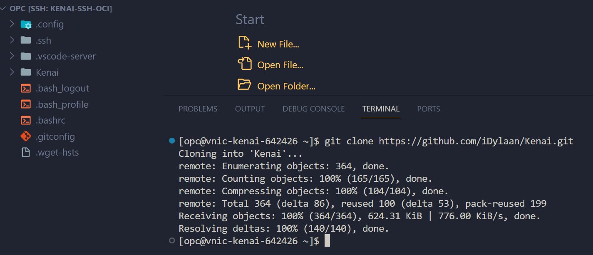

# KENAI Documentación

## Requisitos
1. [Node v20.x](https://nodejs.org/en/download)
2. [NPM v10.x](https://nodejs.org/en/download)
3. [PNPM v8.x](https://pnpm.io/installation)
4. [Nest CLI v10.x](https://docs.nestjs.com/cli/overview)

## Frontend
Seguir los pasos del [Frontend README](./frontend/README.md) 
## Backend
Seguir los pasos del [Backend README](./backend/README.md) 

# Instancia en OCI
1. Crear un VM con Oracle Linux 8 y las siguientes capacidades de Hardware `6 nucleos` y `24GB` con el procesador `Ampere`
2. Una vez creada la VM generar una ssh key, y agregarla a la lista de ssh keys de la VM.
3. Conectarse con las credenciales de ssh
4. Ejecutar el comando `sudo dnf update`

## Requisitos dentro del VM
Es necesario tener instalados los siguientes softwares
### Github CLI 
Se instala con los siguientes comandos
```sh
sudo curl -fsSL https://cli.github.com/packages/rpm/gh-cli.repo | sudo tee /etc/yum.repos.d/github-cli.repo
```
```sh
sudo dnf -y install gh
```
------------------------
Se autenticica generando un token de github generado en settings -> developer settings -> personal access tokens -> Fine-grained tokens y crear un nuevo token


Atentificar con los siguientes comandos
```sh
gh auth login
```
1. Seleccionar GitHub.com
2. Seleccionar HTTPS
3. Dar que si a la autentificación con credenciales
4. Y seleccionar Paste an authentification token
5. Pegar el token generado previamente en GitHub

Para comprobar que la autentificación es correcta ejecutamos el siguiente comando
```sh
gh auth status
```


### Git
Corroborar que ya se encuntra instalado git con el comando
```sh
git --version
```
Si no está instalado ejecutar el siguiente comando
```sh
sudo dnf install git
```

## Clonar proyecto del repositorio
Para clonar le repositorio hay que ejecutar el siguiente comando
```sh
git clone https://github.com/iDylaan/Kenai.git
```


## Python
Es necesario instalar la versión de Python 3.8, para ejecutamos el siguiente comando
```sh
sudo dnf install python3.8
```
Para comprobar que es correcta la instalación ejecutamos el siguiente comando
```sh
python3.8 --version
```

Para comprobar la versión de pip es necesario ejecutar el siguiente comando
```sh
python3.8 -m pip --version
```


## Entorno virtual
1. Para generar el entorno virtual para el proyecto es necesario primero instalar virtualenv, para ello ejecutamos el siguiente comando
```sh
python3.8 -m pip install --user virtualenv
```
2. Acceder al repositorio de Kenai con `cd Kenai/` y generar un entorno virtual con el siguiente comando
```sh
python3.8 -m virtualenv venv
```
3. Accedemos al entorno virtual con:
```sh
source venv/bin/activate
```
4. Accedemos el backend con `cd backend/` e instalamos las dependencias con
```sh
pip install -r requirements.txt
```

## GUNICORN
1. Instalar GUNICORN
```sh
pip install gunicorn
```
2. Crear el archivo `gunicorn_config.py` y dentro colocar la siguiente configuración
```sh
wsgi_app = "APP:app"
bind = "0.0.0.0:5000"
backlog = 2048
workers = 1
worker_class = 'sync'
worker_connections = 1000
keep_alive = 2
timeout = 30
daemon = True

accesslog = '/home/opc/Kenai/backend/gunilogs/gunicorn-access.log'
errorlog = '/home/opc/Kenai/backend/gunilogs/gunicorn-error.log'
pidfile = '/home/opc/Kenai/backend/gunilogs/gunicorn.pid'
reload = False
```
3. Crear el directorio `/gunilogs`
4. Para inciar el servidor con GUNICORN ejecutar el siguiente comando
```sh
gunicorn -c gunicorn_config.py APP:app
```
5. Para terminar el servidor con GUNICORN hay que acceder al archivo `/gunilogs/gunicorn.pid` para copia el id que se encuentra dentro
6. Una vez copiado el id ejecutamos el siguiente comando donde #### es el id que copiamos
```sh
kill #### 
```

## Apache
Primero necesitamos instanciar todo el entorno con Apache para eso necesitamos realizar las siguientes configuraciones
1. Instalar Epel
```sh
sudo dnf install epel-release
sudo dnf -y install https://dl.fedoraproject.org/pub/epel/epel-release-latest-8.noarch.rpm
```
2. Instalar apache y mod_ssl
```sh
sudo dnf -y install httpd mod_ssl
sudo dnf install mod_proxy mod_proxy_http -y
```
3. Habilitar e Iniciar Apache
```sh
sudo systemctl enable httpd
sudo systemctl start httpd
```
4. Proxy
```sh
sudo sed -i '/LoadModule proxy_module/s/^#//g' /etc/httpd/conf.modules.d/00-proxy.conf
sudo sed -i '/LoadModule proxy_http_module/s/^#//g' /etc/httpd/conf.modules.d/00-proxy.conf
```
5. Herramientas de SELinux
```sh
sudo dnf install policycoreutils-python-utils -y
```

### Configuración
Para empezar a realizar la configuración necesitams crear un archivo `.conf` para el proyecto llamado `kenai.conf`
1. Creamos el archivo de configuracion `.conf`
```sh
sudo vi /etc/httpd/conf.d/kenai.conf
```
1. Agregamos la siguiente configuracion
```sh
<VirtualHost *:80>
    ServerName ikenai.site
    ServerAlias www.ikenai.site
    ServerAdmin webmaster@localhost

    # Proxy settings
    ProxyPreserveHost On
    ProxyRequests Off
    ProxyPass / http://127.0.0.1:5000/
    ProxyPassReverse / http://127.0.0.1:5000/

    ErrorLog /var/log/httpd/error.log
    CustomLog /var/log/httpd/access.log combined

    # Rewrite rules to redirect HTTP to HTTPS
    RewriteEngine on
    RewriteCond %{SERVER_NAME} =ikenai.site [OR]
    RewriteCond %{SERVER_NAME} =www.ikenai.site
    RewriteRule ^ https://%{SERVER_NAME}%{REQUEST_URI} [END,NE,R=permanent]
</VirtualHost>

<VirtualHost *:80>
    ServerName 159.54.149.184

    # Proxy settings
    ProxyPreserveHost On
    ProxyRequests Off
    ProxyPass / http://127.0.0.1:5000/
    ProxyPassReverse / http://127.0.0.1:5000/

    ErrorLog /var/log/httpd/error.log
    CustomLog /var/log/httpd/access.log combined
</VirtualHost>
```
4. Comprobar la configuracion colocada
```sh
sudo apachectl configtest
```
5. Crear regla de firewall interno
```sh
sudo firewall-cmd --permanent --zone=public --add-service=http
sudo firewall-cmd --permanent --add-port=5000/tcp
sudo firewall-cmd --reload
```
6. Permitir conexiones proxy con SELinux
```sh
sudo setsebool -P httpd_can_network_connect on
```
7. Reiniciar el servicio
```sh
sudo systemctl restart httpd
```

## Servicio de ollama
1. Ejecutar el reload del daemon
sudo systemctl daemon-reload
2. Habilitar el servicio de ollama
sudo systemctl enable ollama
3. Iniciar el servicio
sudo systemctl start ollama